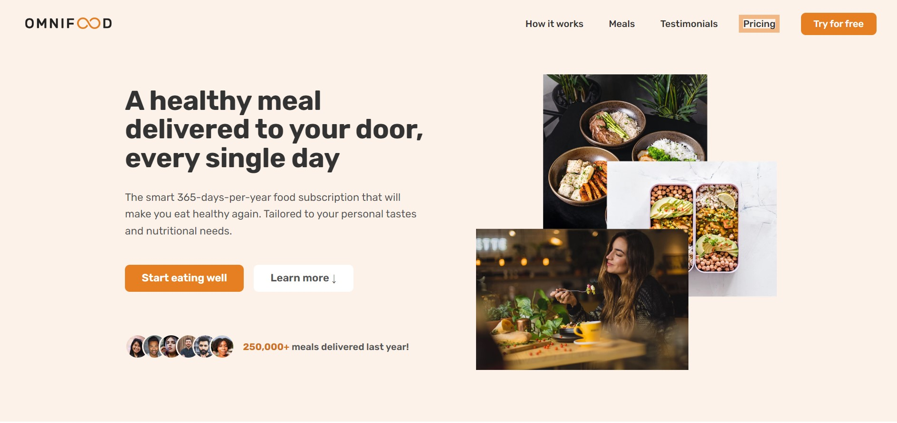
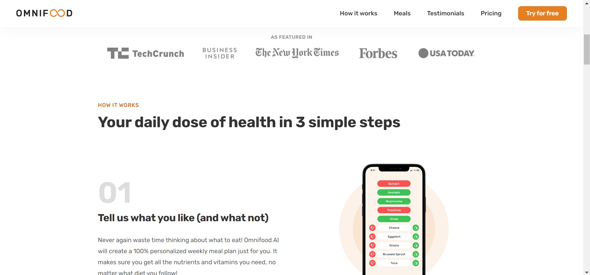
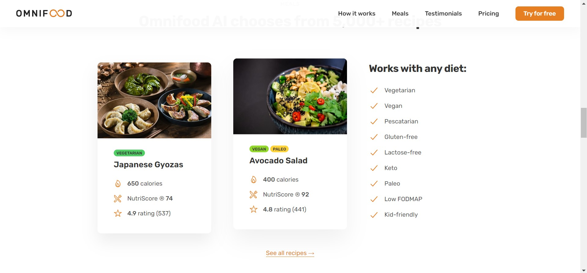
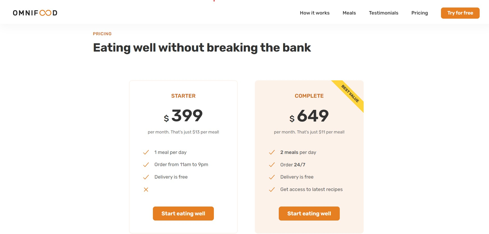
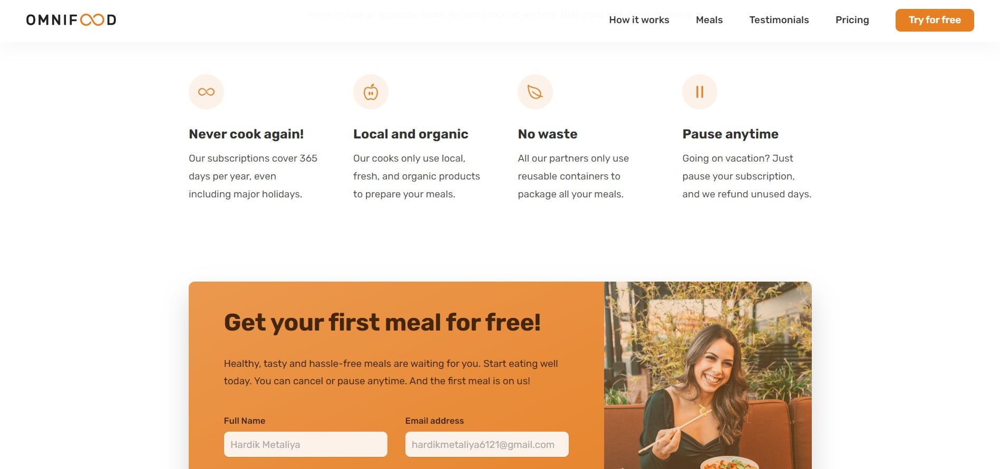
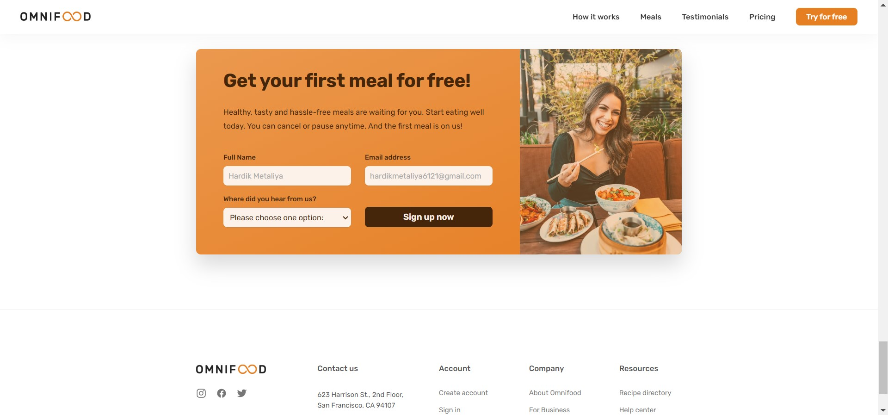

# Omnifood

 ```                              
  ______   .___  ___. .__   __.  __   _______   ______     ______    _______  
 /  __  \  |   \/   | |  \ |  | |  | |   ____| /  __  \   /  __  \  |       \ 
|  |  |  | |  \  /  | |   \|  | |  | |  |__   |  |  |  | |  |  |  | |  .--.  |
|  |  |  | |  |\/|  | |  . `  | |  | |   __|  |  |  |  | |  |  |  | |  |  |  |
|  `--'  | |  |  |  | |  |\   | |  | |  |     |  `--'  | |  `--'  | |  '--'  |
 \______/  |__|  |__| |__| \__| |__| |__|      \______/   \______/  |_______/ 
                              
```
[](https://opensource.org/licenses/MIT)

A fictional online food delivery service website built with HTML, CSS, and JavaScript.

## Demo

You can view the live demo of the Omnifood website [here](https://omnifood-hardikmetaliya.netlify.app/).



## Features

- Responsive design for a seamless user experience on different devices.
- Showcase of different food menus with appealing images and descriptions.
- User-friendly ordering process with a customizable form.
- Integration with a backend server or API for processing orders.

## Installation

To use or contribute to this project, follow these steps:

1. Clone the repository: `git clone https://github.com/your-username/omnifood.git`
2. Navigate to the project directory: `cd omnifood`
3. Open the `index.html` file in your web browser.

## Usage

- Visit the live demo website: [Omnifood Demo](https://omnifood-hardikmetaliya.netlify.app/)
- Explore the different food menus and select your desired items.
- Customize your order using the provided form.
- Submit the order and proceed with the checkout process.
- Enjoy a seamless food delivery experience!

## Screenshots

### Home Page


### Featured In Section


### Recipes Section


### Testimonial Section


### Pricing Section


### Features and Contact Form


## Contact form and Footer


## Contributing

Contributions are welcome! If you have any bug fixes, enhancements, or new features to propose, please open an issue or submit a pull request. Make sure to follow the existing code style and include appropriate tests.

## License

This project is licensed under the MIT License. See the [LICENSE](./LICENSE) file for details.

